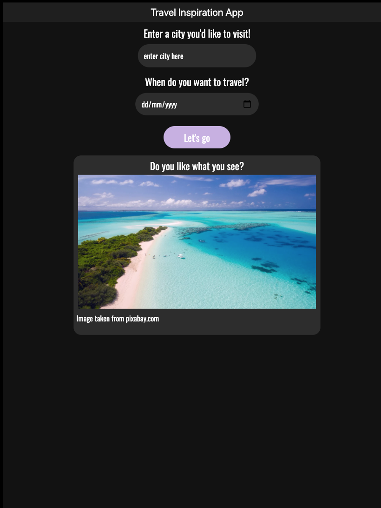
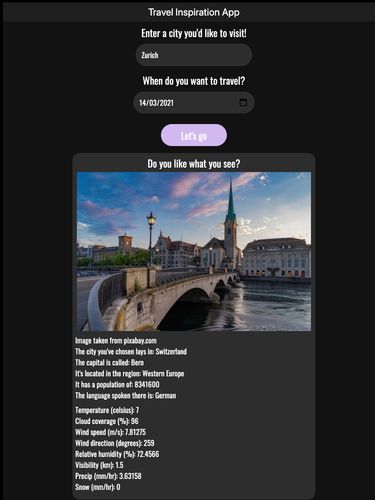

# Travel Inspiration App
This project creates an asynchronous, server-client side web app that uses input by the user (city and date) to display an image of the chosen city and information about its country, plus the weather forecast (within the next 16 days). Does that sound interesting? Yes, then go check it out!

Home screen             |  Answer screen
:-------------------------:|:-------------------------:
  |  

## Highlights
Are you interested in:
- Setting up Webpack
- Sass styles
- Webpack Loaders and Plugins
- Creating layouts and page design
- Service workers
- Using APIs and creating requests to external urls

Then this is an excellent project to dive into.

## Requirements
Start by setting up your project environment. 
1. Download and [install Node](https://nodejs.org/en/download/).
2. `git clone https://github.com/ImmanuelXIV/travel-app`
3. `cd travel-app`
4. Run `npm install` to install all dependencies listed in `package.json` (e.g., webpack, babel, node-sass, and jest).

## Get API Credentials
- Go to [GeoNames.org](https://www.geonames.org/export/web-services.html), [Weatherbit.io](https://www.weatherbit.io/account/create), and [Pixabay.com](https://pixabay.com/service/about/api/) and create free accounts.
- Create a file called `.env` in the root `travel-app` folder and replace the `xxxxxxxxxxxx` with your API credentials as shown underneath
```
GEO_USER=xxxxxxxxxxxx
WEATHERBIT_API_KEY=xxxxxxxxxxxx
PIXABAY_API_KEY=xxxxxxxxxxxx
```

## Run The App
Run the production web app
- Run `npm run build-prod`. This should finish without an error.
- Run `npm run start` to start the server.
- Go to [http://localhost:9000/](http://localhost:9000/) in your browser (e.g., Google Chrome).
- Enter a `city` and `date` (within the next 16 days) into the fields and press the button. 
- The results should be displayed underneath.

Run in development mode
- Run `npm run build-dev`. This should open a new tab ([http://localhost:8080/](http://localhost:8080/)) in your browser 
- In order for the app to function, follow the steps above to run the production web app and start the server.
- Play around with different `city` and `date` inputs, though only submit valid input in English language.

## Testing The App With Jest
If you want to check out the basic Jest unit tests in the repository, then
- Go to the root folder in the terminal `cd travel-app`.
- Run `npm run test` in the terminal and inspect the test results.

## Extend this Project?
If you are interested, you can 
- Deploying the project e.g., on [Netlify](https://www.netlify.com/) or [Heroku](https://www.heroku.com/) should be fun.
- Add an end date and display the length of trip.
- Allow the user to add multiple destinations on the same trip.
- Pull in weather data for additional locations.
- Allow the user to add hotel and/or flight data.
- Allow multiple places to stay? Multiple flights?
- Allow the user to remove the trip.
- Use Local Storage to save the data so that when they close, then revisit the page, their information is still there.
- Instead of just pulling a single day forecast, pull the forecast for multiple days.
- Incorporate icons into the forecast.
- Allow the user to print their trip and/or export it to PDF.
- Allow the user to add a todo list and/or packing list for their trip.
- Allow the user to add additional trips (this may take some heavy reworking, but is worth the challenge).
- Automatically sort additional trips by countdown.
- Move expired trips to the bottom/have their style change so it’s clear they are expired.
